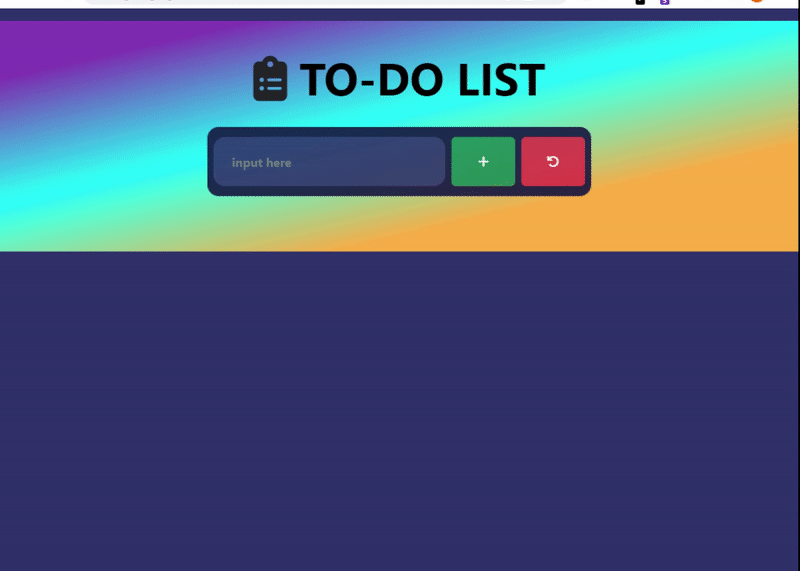

# todo

## Table of contents

- [Overview](#overview)
  - [The challenge](#the-challenge)
  - [User Stories](#user-stories)
  - [Project Skeleton](#project-skeleton)
  - [Screenshot](#screenshot)
  - [Links](#links)
- [My process](#my-process)
  - [Built with](#built-with)


## Overview

### The challenge

Your company has recently started on a project that aims to create a simple To-Do App. So you and your colleagues have started to work on the project.

### User Stories
   - When I click the "+" button on the app to be performed, the new job will be added to the list.
   - When the plus button is clicked, a warning message is given to the user if the input field is empty
   - Clicking on items in the to do list will make the task red
   - Clicking the trash can button in the application to be performed turns the task red first. You can then remove the task from the list with the second click. If the task is not red, the deletion does not occur.
   - When i click the red reload button in the app, it will reset the entire list.
   
### Project Skeleton

```
todo (folder)
        |----app.js
        |----index.html 
        |----style.css
        img (folder)
                |----clipboard-list-solid.svg
             
```
### Screenshot

<p align="center">
<a href="https://sezginakgul.github.io/todo/"></a>
</p>


### Links

- Live: [Live Website](https://sezginakgul.github.io/todo/)


### Built with

- Javascript DOM
- Javascript Events
- Javascript Functions
- Bootstrap
- Semantic HTML5 markup
- CSS custom properties
- Flexbox
- Mobile-first workflow
- Styled Components - For styles
- HTML Forms-Input Types
- HTML Form Elements
- CSS Colors-Border Properties
- CSS Margins-Padding
- CSS Properties for Texts-Font Families-Links
- CSS Overflow Property-The float Property-Opacity 
- Transparency-Units in CSS
- CSS Setting height and width-CSS Outline-CSS Combinators
- Comments


